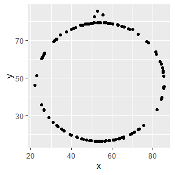

Lab 01 - Hello R
================
Ben Hardin
1/13/2023

## Load packages and data

``` r
library(tidyverse) 
library(datasauRus)
```

## Exercises

### Exercise 1

The datasaurus_dozen dataframe has 1846 rows and 3 columns, or
variables. These variables are:

1.  dataset - which dataset the data are from

2.  x - x-values

3.  y - y-values

### Exercise 2

The purpose of this exercise is to visualize and describe the
relationship between variables x & y in the dino dataset.

The first part of code below filters out all the datasets in the
datasaurus_dozen data frame besides the dino dataset, so that we can
plot that dataset specifically.

The second part of the code creates a scatterplot of values x & y using
the ggplot function. The arguments (1) select the filtered dataset we
just made, (2) assigns the x variable to the x axis and the y variable
to the y axis, (3) chooses points as our shape for representing each
datapoint. The result is a beautiful dinosaur!

``` r
dino_data <- datasaurus_dozen %>%
  filter(dataset == "dino")

ggplot(data = dino_data, mapping = aes(x = x, y = y)) +
  geom_point()
```

<!-- -->

Finally, the code below calculates the correlation between x and y in
the dino dataset and makes a table showing the correlation coefficient
(r = -.065). This correlation sadly is misleading and does not capture
the majesty of the dinosaur.

``` r
dino_data %>%
  summarize(r = cor(x, y))
```

    ## # A tibble: 1 × 1
    ##         r
    ##     <dbl>
    ## 1 -0.0645

### Exercise 3

The purpose of this exercise is to visualize and describe the star
dataset.

The code chunk below replicates the code we used above for the dino
dataset, except this time we are filtering for the star dataset instead.
As we might expect from the name, the scatterplot of x & y for this
dataset looks like a star.

``` r
star_data <- datasaurus_dozen %>%
  filter(dataset == "star")

ggplot(data = star_data, mapping = aes(x = x, y = y)) +
  geom_point()
```

<!-- -->

Now, we can see how x & y are correlated in this dataset. Again, all we
have to do is re-use our code from above, but now using the star dataset
we made earlier.

The correlation between x & y is almost exactly the same as in the dino
dataset, but very slightly smaller (r = -.063).

``` r
star_data %>%
  summarize(r = cor(x, y))
```

    ## # A tibble: 1 × 1
    ##         r
    ##     <dbl>
    ## 1 -0.0630

### Exercise 4

The purpose of this exercise is to visualize and describe the circle
dataset.

Just like before, we can re-use the same code except filtering for the
circle dataset this time. When we plot x & y, we get a circle shaped
scatterplot!

``` r
circle_data <- datasaurus_dozen %>%
  filter(dataset == "circle")

ggplot(data = circle_data, mapping = aes(x = x, y = y)) +
  geom_point()
```

<!-- -->

The correlation between x & y in the circle dataset is extremely close
to what we saw in the dino and star datasets, but very slightly larger
(r = -.068)

``` r
circle_data %>%
  summarize(r = cor(x, y))
```

    ## # A tibble: 1 × 1
    ##         r
    ##     <dbl>
    ## 1 -0.0683

### Exercise 5

The purpose of exercise 5 is to visualize and describe all the datasets
in the datasaurus dozen.

The code chunk below allows us to generate scatterplots for each of the
different datasets all at once, by “faceting” the full dataframe by the
dataset variable. The result is a grid where each cell is a scatterplot
of one of the facets, or datasets. Now we can see the shape of the
relationship between x & y in each of these different datasets in one
figure.

``` r
ggplot(datasaurus_dozen, aes(x = x, y = y, color=dataset))+
  geom_point()+
  facet_wrap(~ dataset, ncol = 3)+
  theme(legend.position = "none")
```

<!-- -->

Finally, we can calculate the correlation between x & y separately for
each dataset all at once, by grouping our data by the dataset variable.
Results show that, although the shape of relationship between x & y is
very different between these datasets, they all show virtually the same
correlation (rs = -.06 to -.069).

``` r
datasaurus_dozen %>%
  group_by(dataset) %>%
  summarize(r = cor(x, y)) %>%
  print(13)
```

    ## # A tibble:
    ## #   13 × 2
    ##    dataset   
    ##    <chr>     
    ##  1 away      
    ##  2 bullseye  
    ##  3 circle    
    ##  4 dino      
    ##  5 dots      
    ##  6 h_lines   
    ##  7 high_lines
    ##  8 slant_down
    ##  9 slant_up  
    ## 10 star      
    ## 11 v_lines   
    ## 12 wide_lines
    ## 13 x_shape   
    ## # … with 1
    ## #   more
    ## #   variable:
    ## #   r <dbl>

## Bonus Tips by Yoo Ri

Here are some helpful tips :)

- filter() is for extracting rows

- group_by() is for grouping datasets by assigned column

- ungroup() cancels the grouping

- summarize() is often used with group_by(). This function can print the
  output according to the group_by().

- facet_grid(y\~x,…) creates a grid with variable y as a row, variable x
  as a column  

- facet_wrap(x,… ) is useful when there is only one variable
